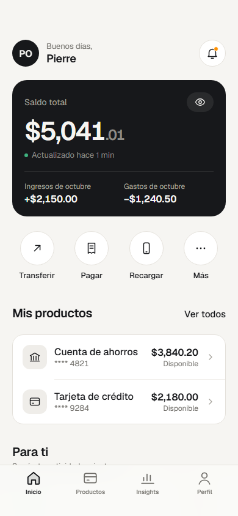
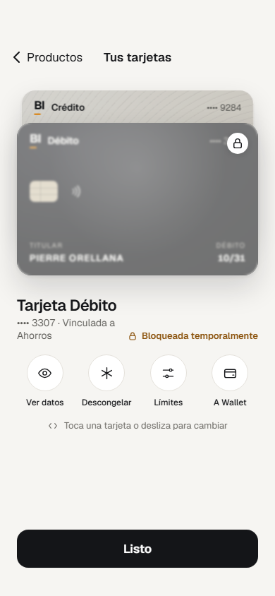
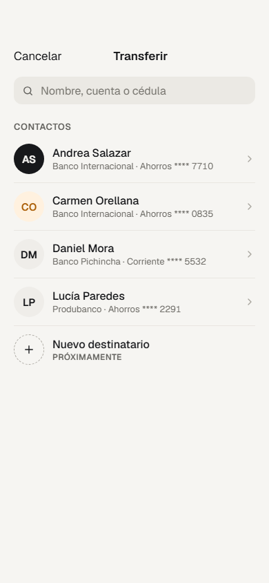
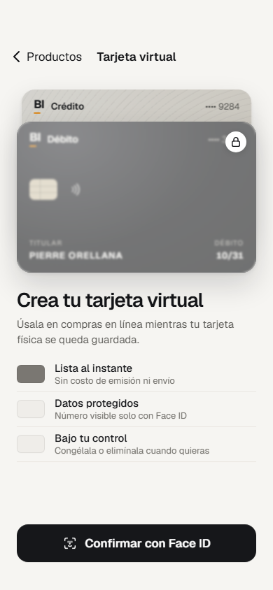

# BInova Mobile

<p align="center">
  
</p>

<p align="center">
  Una experiencia financiera digital clara, segura y diseñada para el día a día.
</p>

<p align="center">
  <a href="https://drive.google.com/file/d/12PDgPL1jZtO3jYduxqTKjcB9-YxsrHaS/view?usp=sharing">▶ Ver demo en ejecución</a>
  ·
  <a href="#inicio-rápido">Comenzar</a>
  ·
  <a href="#arquitectura">Arquitectura</a>
</p>

<p align="center">
  <strong>Flutter</strong> · <strong>Provider</strong> · <strong>Clean Architecture</strong> · <strong>Android + iOS</strong>
</p>

> BInova es la aplicación móvil de la prueba técnica Senior Front-End para Banco Internacional. El proyecto prioriza una experiencia bancaria moderna, modular y confiable, con flujos de autenticación, productos, operaciones, tarjetas virtuales y estados degradados.

## Producto en una mirada

| Experiencia | Capacidades | Enfoque técnico |
|---|---|---|
| Inicio | Saldo, productos, acciones rápidas y recomendaciones | UI orientada a tareas y estados server-driven acotados |
| Operaciones | Transferir, pagar y recargar | Confirmación, biometría, idempotencia y estados de resultado |
| Tarjetas | Stack visual, tarjeta virtual, congelar, límites y Wallet | Animaciones nativas, perspectiva y control de estado |
| Seguridad | Login, sesión segura, refresh y Face ID | Secure storage, biometría local y errores explícitos |
| Resiliencia | Offline, stale, timeout, retry y servicio parcial | Caché local y Developer Tools para demostración |

## Experiencia visual

Las siguientes capturas fueron obtenidas directamente del prototipo HTML de referencia y se versionan dentro de este repositorio para que la presentación del proyecto sea autocontenida.

<table align="center">
  <tr>
    <td align="center"><br><sub>Home</sub></td>
    <td align="center"><br><sub>Tarjetas</sub></td>
  </tr>
  <tr>
    <td align="center"><br><sub>Transferencias</sub></td>
    <td align="center"><br><sub>Tarjeta virtual</sub></td>
  </tr>
</table>

## Demo en ejecución

🎬 **[Ver la demostración completa en Google Drive](https://drive.google.com/file/d/12PDgPL1jZtO3jYduxqTKjcB9-YxsrHaS/view?usp=sharing)**

La demo muestra la aplicación levantada, sus transiciones y los flujos principales de navegación. Si el enlace solicita permisos, se debe abrir con una cuenta autorizada por el propietario del archivo.

## Funcionalidades principales

- Splash, onboarding, login, sesión segura, refresh y Face ID.
- Home con saldo, productos, acciones rápidas, movimientos y sección Para ti.
- Cuentas, detalle de producto, movimientos paginados y detalle en hoja visual.
- Transferencias, pagos y recargas con confirmación y estados `processing`, `succeeded`, `pending` y `failed`.
- Creación de tarjeta virtual con confirmación biométrica y animación de construcción/apilado.
- Gestión de tarjetas: congelar/descongelar, límites y handoff a Wallet.
- Insights, conversor de moneda, notificaciones, perfil y preferencias.
- Estados de carga, error, timeout, offline, stale, reintento y servicio parcialmente disponible.
- Developer Tools para demostrar `normal`, `slow`, `offline`, `server error` y `timeout`.

La recuperación de contraseña forma parte únicamente de la experiencia visual del prototipo. No existe endpoint ni persistencia backend para este flujo en el MVP.

## Stack

| Área | Tecnología |
|---|---|
| Aplicación | Flutter / Dart |
| Estado | Provider / ChangeNotifier |
| Arquitectura | Clean Architecture organizada por features |
| Seguridad | `flutter_secure_storage` y `local_auth` |
| Red | Cliente HTTP autenticado, refresh y envelope REST |
| Notificaciones | Firebase Cloud Messaging y notificaciones locales |
| Diseño | Geist, SVG, design tokens y motion nativo |
| Soporte de datos | API NestJS, PostgreSQL y Prisma |

## Inicio rápido

### Requisitos

- Flutter 3.47.5 y Dart compatible.
- FVM instalado.
- Android Studio con un emulador Android, o Xcode con un simulador/dispositivo iOS.
- Node.js, npm y Docker Compose si se utilizará el API local.

### Instalar dependencias

Desde la raíz de este repositorio:

```bash
fvm install
fvm use 3.47.5
fvm flutter pub get
```

### Levantar el API local

El API es soporte de integración para ejecutar los flujos con datos reales. Desde un checkout local del API:

```powershell
Copy-Item .env.example .env
npm ci
npm run prisma:generate
docker compose up -d postgres
npm run prisma:deploy
npm run seed
npm run start:dev
```

El API queda disponible en `http://localhost:3000/v1`.

Credenciales de demostración:

```text
Usuario:    demo@binova.local
Contraseña: Demo1234!
```

### Ejecutar en Android Emulator

```bash
fvm flutter run \
  --dart-define=API_BASE_URL=http://10.0.2.2:3000/v1 \
  --dart-define=ENVIRONMENT=local
```

### Ejecutar en iOS Simulator

```bash
fvm flutter run \
  --dart-define=API_BASE_URL=http://127.0.0.1:3000/v1 \
  --dart-define=ENVIRONMENT=local
```

### Ejecutar en dispositivo físico

Usa una dirección accesible desde el dispositivo, preferiblemente HTTPS:

```bash
fvm flutter run \
  --dart-define=API_BASE_URL=https://<host-accesible>/v1 \
  --dart-define=ENVIRONMENT=local
```

`API_BASE_URL` sobrescribe la URL compilada por defecto. Los ambientes soportados son `local`, `dev`, `test`, `demo` y `prodEvolution`.

## Flujos recomendados para revisar

1. Splash → onboarding → login → Face ID/reingreso.
2. Home → Productos → Cuenta → Movimientos → Detalle.
3. Tarjetas → Crear tarjeta virtual → Face ID → construcción/apilado → resultado.
4. Detalle de tarjeta → congelar/descongelar → límites → Wallet.
5. Transferir, pagar y recargar → confirmación → biometría → resultado.
6. Insights, conversor, notificaciones y perfil.
7. Developer Tools → offline/timeout/error → retry y recuperación.

## Pruebas y calidad

```bash
fvm flutter analyze
fvm flutter test
fvm flutter test test/widgets_accessibility_test.dart
```

El E2E crítico se ejecuta con el API accesible desde un emulador o dispositivo:

```bash
fvm flutter test integration_test/critical_flow_test.dart \
  -d <device-id> \
  --dart-define=API_BASE_URL=http://10.0.2.2:3000/v1 \
  --dart-define=ENVIRONMENT=local
```

Flujo cubierto:

```text
Login → Home → Productos → Cuenta de ahorros → Movimientos → Detalle
```

## Arquitectura

```text
lib/
├── app/          # bootstrap, routing, tema y navegación
├── core/         # red, errores, seguridad, storage, observabilidad y design system
└── features/     # auth, home, accounts, transactions, cards, operations,
                  # insights, exchange, notifications y profile
```

Cada feature separa `data`, `domain` y `presentation`:

- `data`: data sources remotos, DTOs y repositories.
- `domain`: entidades, contratos y reglas independientes de Flutter.
- `presentation`: páginas, widgets y controllers Provider/ChangeNotifier.

Los widgets no realizan HTTP directamente. Los controllers coordinan los casos de uso y exponen estados de presentación para la UI.

## Firebase y notificaciones

La integración Android utiliza `firebase_core`, `firebase_messaging` y notificaciones locales. El registro de dispositivos y el inbox consumen el API REST.

- `android/app/google-services.json` y `lib/firebase_options.dart` contienen la configuración pública Android necesaria para el proyecto configurado.
- El archivo de cuenta de servicio Firebase pertenece al API y nunca debe copiarse al app ni versionarse.
- La configuración iOS requiere `GoogleService-Info.plist`, capacidades nativas, permisos y credenciales del ambiente final.
- Nunca versionar claves privadas, tokens FCM, `.env` ni cuentas de servicio.

## Colaboración

El repositorio utiliza Trunk Based Development:

- `main` debe permanecer integrable.
- Los cambios pequeños pueden integrarse directamente; los cambios mayores usan ramas cortas.
- Cada commit representa una sola intención y utiliza Conventional Commits: `feat`, `fix`, `test`, `docs`, `refactor` o `chore`.
- Antes de integrar: `fvm flutter analyze`, `fvm flutter test` y revisión visual cuando el cambio afecte UI.

## Limitaciones conocidas

- Firebase/FCM iOS y la configuración final por ambiente dependen de credenciales externas.
- El proveedor FX real requiere URL y credenciales; el adapter demo es determinista.
- El signing y el despliegue productivo no forman parte del cierre local de la prueba.
- La recuperación de contraseña es solamente visual.

## API de soporte

El backend complementario está disponible en [api_binova](https://github.com/pierorellana/api_binova). Para una demostración completamente local, levanta el API y configura `API_BASE_URL` según la plataforma.
